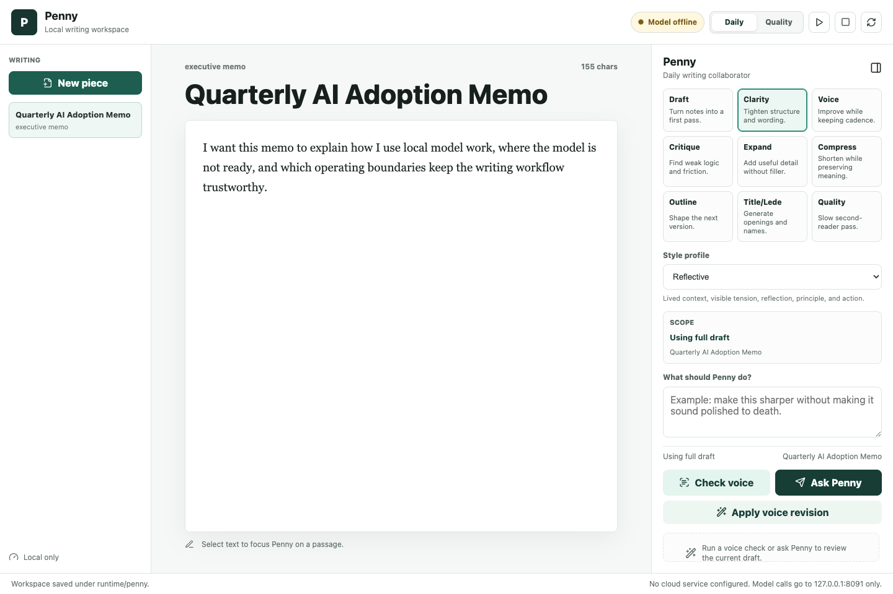

# Penny Writing Workspace

Penny is a local-first writing workspace for drafting, selected-text revision,
deterministic style review, and explicit application of model suggestions. The
browser UI, workspace server, and model traffic bind to loopback by default.

Penny is deliberately cautious about authorship. A model response becomes a
reviewable candidate; it cannot change the draft until the writer applies it.
Deterministic checks are editing signals, not proof of authorship or quality.



## What Penny Includes

- Three-pane writing workspace with projects and documents.
- Selected-text and full-draft collaboration modes.
- Response candidates, inline notes, previews, discard, apply, and session undo.
- Generic reflective, executive, and raw-journal profiles.
- Schema-validated, data-only local voice packs.
- Deterministic House Style, AI-voice, center-of-gravity, and punctuation checks.
- Optional OpenAI-compatible loopback model and runtime-control adapters.
- Optional Tailscale Serve path mode with host and identity allowlists.

## Requirements

- Node.js 22 or newer.
- npm.
- A Chromium browser for browser smoke tests.
- Optional: an OpenAI-compatible model endpoint on loopback.

## Quickstart

```sh
npm install
npm run build
npm run server
```

Open `http://127.0.0.1:4177`. The editor and deterministic checks work without
a model. Model-backed actions use `http://127.0.0.1:8091/v1` by default.

To use another loopback endpoint:

```sh
PENNY_MODEL_BASE_URL=http://127.0.0.1:9000/v1 npm run server
```

Penny rejects non-loopback model URLs.

## Voice Packs

The built-in pack is in `voice-packs/default/voice-pack.json`. Load additional
local JSON packs from a directory:

```sh
PENNY_VOICE_PACK_DIR=/opt/penny/voice-packs npm run server
```

Packs contain data only. Penny rejects unknown fields, unsupported versions,
duplicate profile IDs, absolute paths in pack text, and unsupported policies.
See [Voice packs](docs/voice-packs.md).

## Optional Runtime Adapter

Set `PENNY_RUNTIME_SCRIPT` to an executable that accepts Penny's allowlisted
runtime actions. Runtime controls remain unavailable when no adapter is set.

```sh
PENNY_RUNTIME_SCRIPT=/opt/penny-runtime/writing-runtime.sh npm run server
```

## Optional Tailscale Access

Penny can run behind Tailscale Serve while the application still listens only
on loopback. Use a host allowlist and, where applicable, a Tailscale user
allowlist. Remote runtime actions remain disabled unless explicitly enabled.

```sh
PENNY_TAILSCALE_HOST=writer-server.example-tailnet.ts.net \
PENNY_TAILSCALE_USERS=writer@example.com \
PENNY_TAILSCALE_PATH=/penny \
scripts/penny-tailscale.sh on
```

Review the script output before using it on a host that already has Tailscale
Serve routes.

## Validation

```sh
npm run validate
npm audit --audit-level=high
scripts/check-public-tree.sh
```

`npm run validate` runs Node tests, Python script tests, the production build,
browser smoke, and the runtime parity dry run. The browser smoke may target an
already running server through `PENNY_BASE_URL`.

## Architecture And Security

- [Architecture](docs/architecture.md)
- [Voice packs](docs/voice-packs.md)
- [Security policy](SECURITY.md)
- [Contributing](CONTRIBUTING.md)

Workspace files, model weights, logs, drafts, environment files, and local
voice packs are ignored. Do not publish a working-directory copy; publish from
reviewed Git history or a Git archive.

## License

MIT. See [LICENSE](LICENSE).
